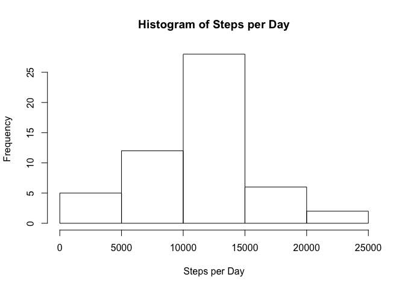
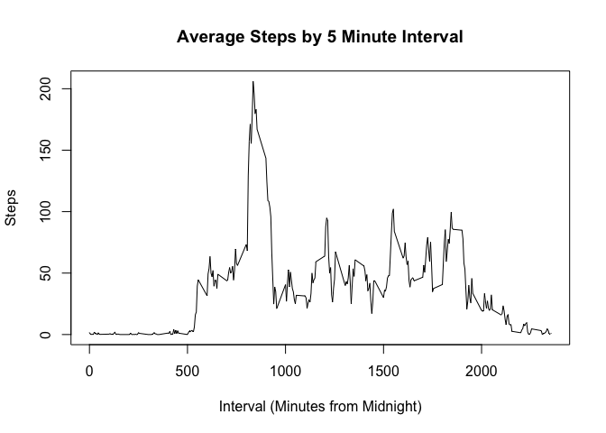
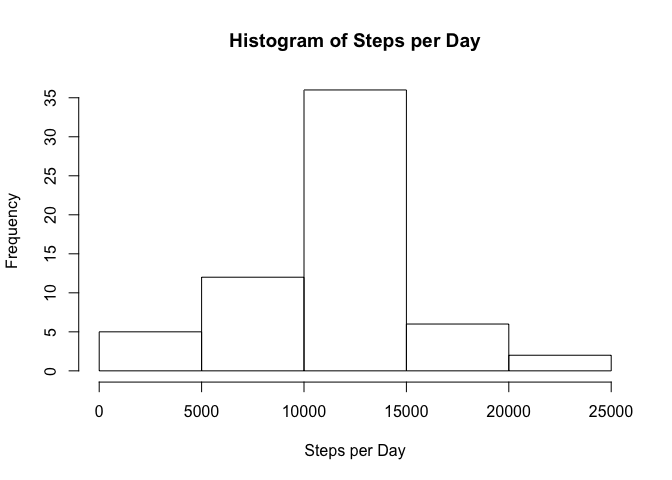
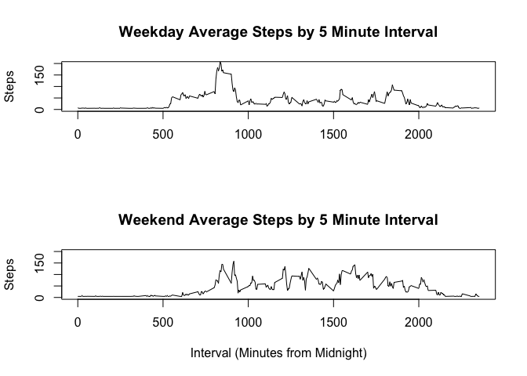

# Reproducible Research: Peer Assessment 1


```
## 
## Attaching package: 'dplyr'
## 
## The following objects are masked from 'package:plyr':
## 
##     arrange, count, desc, failwith, id, mutate, rename, summarise,
##     summarize
## 
## The following object is masked from 'package:stats':
## 
##     filter
## 
## The following objects are masked from 'package:base':
## 
##     intersect, setdiff, setequal, union
```

##Loading and Preprocessing the Data

First read in the csv file containing the activity data and sort it by date and time.


```r
activity <- read.csv("activity.csv")
activity <- arrange(activity, date, interval)
```

##Basic Analysis of The Number of Step Totals
###What is the Total Number of Steps Taken Each Day?

Create a data frame summarising the number of steps taken on each day in the sample.


Display the results, sorted by date.


```r
activityByDay <- ddply(activity, "date", summarise, TotalSteps = sum(steps))
arrange(activityByDay, date)
```

```
##          date TotalSteps
## 1  2012-10-01         NA
## 2  2012-10-02        126
## 3  2012-10-03      11352
## 4  2012-10-04      12116
## 5  2012-10-05      13294
## 6  2012-10-06      15420
## 7  2012-10-07      11015
## 8  2012-10-08         NA
## 9  2012-10-09      12811
## 10 2012-10-10       9900
## 11 2012-10-11      10304
## 12 2012-10-12      17382
## 13 2012-10-13      12426
## 14 2012-10-14      15098
## 15 2012-10-15      10139
## 16 2012-10-16      15084
## 17 2012-10-17      13452
## 18 2012-10-18      10056
## 19 2012-10-19      11829
## 20 2012-10-20      10395
## 21 2012-10-21       8821
## 22 2012-10-22      13460
## 23 2012-10-23       8918
## 24 2012-10-24       8355
## 25 2012-10-25       2492
## 26 2012-10-26       6778
## 27 2012-10-27      10119
## 28 2012-10-28      11458
## 29 2012-10-29       5018
## 30 2012-10-30       9819
## 31 2012-10-31      15414
## 32 2012-11-01         NA
## 33 2012-11-02      10600
## 34 2012-11-03      10571
## 35 2012-11-04         NA
## 36 2012-11-05      10439
## 37 2012-11-06       8334
## 38 2012-11-07      12883
## 39 2012-11-08       3219
## 40 2012-11-09         NA
## 41 2012-11-10         NA
## 42 2012-11-11      12608
## 43 2012-11-12      10765
## 44 2012-11-13       7336
## 45 2012-11-14         NA
## 46 2012-11-15         41
## 47 2012-11-16       5441
## 48 2012-11-17      14339
## 49 2012-11-18      15110
## 50 2012-11-19       8841
## 51 2012-11-20       4472
## 52 2012-11-21      12787
## 53 2012-11-22      20427
## 54 2012-11-23      21194
## 55 2012-11-24      14478
## 56 2012-11-25      11834
## 57 2012-11-26      11162
## 58 2012-11-27      13646
## 59 2012-11-28      10183
## 60 2012-11-29       7047
## 61 2012-11-30         NA
```


Plot a histogram examining the frequency distribution of the number of steps taken each day.


```r
hist(activityByDay$TotalSteps, main="Histogram of Steps per Day", xlab="Steps per Day")
```

 

### What are the Mean and Median Number of Steps?
Find the mean and the median number of steps for each day in the sample. 
NAs are handled as there are missing values in the data set. 


```r
mean(activityByDay[["TotalSteps"]], na.rm=TRUE)
```

```
## [1] 10766.19
```

```r
median(activityByDay[["TotalSteps"]], na.rm=TRUE)
```

```
## [1] 10765
```


##What is the Average Daily Activity Pattern?
Summarise by each 5 minute interval, but first remove the NAs from the data set as there 
is an NA value for each and every five minute interval on at least one day.
Failure to remove these first will result in just NAs in the summarised output.


```r
goodActivity <- activity[complete.cases(activity),]
activityByInterval <- ddply(goodActivity, "interval", summarise, TotalSteps = sum(steps), AverageSteps = mean(steps))
```

Now plot the average number of steps taken within each five minute interval across the observation period.


```r
plot(activityByInterval$interval, activityByInterval$AverageSteps, type="l", main="Average Steps by 5 Minute Interval",
        xlab="Interval (Minutes from Midnight)", ylab="Steps")
```

 

###On Average, Which Five Minute Interval Has The Most Steps Taken?


```r
tail(arrange(activityByInterval, AverageSteps),1)
```

```
##     interval TotalSteps AverageSteps
## 288      835      10927     206.1698
```

Therefore, the period from 8.35 - 8.39 am is the most active, on average.

##Imputing Missing Values
Determine how many rows having missing values


```r
goodRows <- complete.cases(activity)
sum(!goodRows)
```

```
## [1] 2304
```

For the averaging work to date this missing values have been discarded.
Now use an imputed value to determine if it has an impact. 

The strategy used is basic: simply dividing the mean total steps by day by the number 
of five minute periods in the day, and substituing that for each missing value.

A new data set is created with the missing values filled.


```r
imputActivity <- activity

imputActivity[is.na(imputActivity)] <- 10766/288
```

Now this new data set is prepared for work allowing it to be compared with the set with NAs omitted
to determine what the impact of that omission (compared with the imputation strategy) was.


```r
imputActivityByDay <- ddply(imputActivity, "date", summarise, TotalSteps = sum(steps))
```


The below histogram examins the frequency distribution of the number of steps taken each day.


```r
hist(imputActivityByDay$TotalSteps, main="Histogram of Steps per Day", xlab="Steps per Day")
```

 


Find the mean and the median number of steps for each day in the imputed sample. 


```r
mean(imputActivityByDay[["TotalSteps"]])
```

```
## [1] 10766.16
```

```r
median(imputActivityByDay[["TotalSteps"]])
```

```
## [1] 10766
```

From this observation it can be seen that the choice of using imputed values, rather than omitting missing values,
had only a very small impact, shifting the mean by 0.0003% and the median by 0.01%.

However, the distribution of steps between 10000 and 15000 did become higher.

##Do Weekdays and Weekends Have Different Activity Patterns?

First determine if each date is a weekday or a weekend


```r
## get the day of thw week name
imputActivity$Wday <- weekdays(as.POSIXlt(imputActivity$date))

## now change Sat or Sun to be weekend
imputActivity$Wday[imputActivity$Wday == 'Saturday' | imputActivity$Wday == 'Sunday'] <- 'Weekend'

## now make the remainder weekend (i.e. all other days of the week)
imputActivity$Wday[imputActivity$Wday != 'Weekend'] <- 'Weekday'

## finally make it a facotr
imputActivity$Wday <- as.factor(imputActivity$Wday)
```


Subset the datasets to have one with just weekend readings and another with just weekday readings.


```r
weekEnd <- filter(imputActivity, Wday == "Weekend")
weekDay <- filter(imputActivity, Wday == "Weekday")
```

And group each by interval 


```r
WEactivityByInterval <- ddply(weekEnd, "interval", summarise, TotalSteps = sum(steps), AverageSteps = mean(steps))
WDactivityByInterval <- ddply(weekDay, "interval", summarise, TotalSteps = sum(steps), AverageSteps = mean(steps))
```

Plotting the weekend vs weekday data shows that a variation bewtween weekend and weekday actvity does exist. 
Weekend activity commences later in the day and has a more sustained pattern throughout the period from around
10am to 6pm than that seen on weekdays. Weekday activity has a higher peak around 8.00 to 9.00 than is seen on weekends.


```r
par(mfrow = c(2,1), main="Title")
```

```
## Warning in par(mfrow = c(2, 1), main = "Title"): "main" is not a graphical
## parameter
```

```r
plot(WDactivityByInterval$interval, WDactivityByInterval$AverageSteps, type="l", main="Weekday Average Steps by 5 Minute Interval",
      xlab="", ylab="Steps", ylim = c(0,200))
plot(WEactivityByInterval$interval, WEactivityByInterval$AverageSteps, type="l", main="Weekend Average Steps by 5 Minute Interval",
     xlab="Interval (Minutes from Midnight)", ylab="Steps", ylim = c(0,200))
```

 


END OF REPORT


